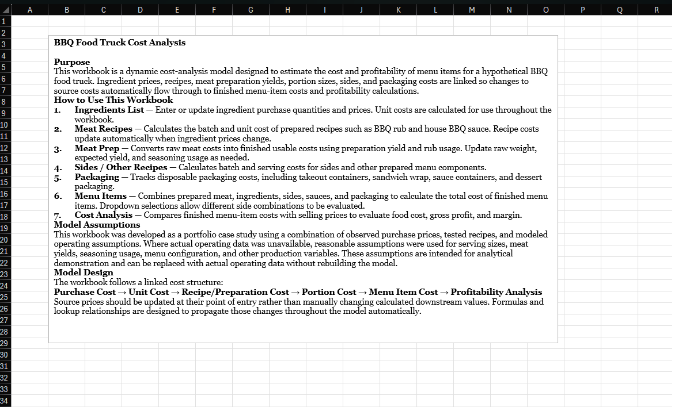

# BBQ Food Truck Cost Analysis

## Project Overview
This project is a dynamic Excel cost-analysis model developed for a hypothetical BBQ food truck. The workbook traces ingredient and packaging purchase costs through recipe production, meat preparation yields, portioning, finished menu-item costs, and profitability analysis.

The model was designed so changes to upstream costs automatically propagate through affected recipes, prepared products, menu items, and final cost analysis.

## Business Problem
Determining the true cost of a food-service menu item requires more than comparing ingredient purchase prices with selling prices. Raw meat yield, recipe ingredients, portion sizes, sides, sauces, packaging, and changing supplier costs all affect the actual cost of the finished product.

This model consolidates those factors into a linked Excel decision-support tool that can be updated as costs or operating assumptions change.

## Model Flow

**Purchase Cost → Unit Cost → Recipe/Preparation Cost → Portion Cost → Menu Item Cost → Profitability Analysis**

## Project Preview

### Cost Analysis
The final analysis compares finished menu-item costs with selling prices and evaluates gross profit, food-cost percentage, and suggested pricing based on an adjustable target food-cost percentage.

### Dynamic Menu Costing
Menu items combine prepared proteins, sides, sauces, ingredients, and packaging into a finished unit cost. Dropdown selections allow different side combinations to be evaluated without rebuilding the underlying calculations.

### Meat Preparation & Yield
Raw meat costs are adjusted for preparation yield and seasoning usage to calculate finished cost per pound. Changes to upstream ingredient or meat prices automatically propagate through downstream menu-item and profitability calculations.

### Recipe Costing
Prepared recipes are broken down by ingredient quantity and unit cost to calculate total recipe cost and cost per serving. Dessert recipes demonstrate how multi-ingredient products are incorporated into the same linked costing model.

### Workbook Guide
The workbook includes documentation explaining the model's purpose, assumptions, worksheet functions, and linked cost structure so the analysis can be understood and updated by another user.

## Model Flow

**Purchase Cost → Unit Cost → Recipe/Preparation Cost → Portion Cost → Menu Item Cost → Profitability Analysis**

## Project Preview

### Cost Analysis
The final analysis compares finished menu-item costs...

[rest of Project Preview...]

## Key Features
- Standardizes bulk ingredient purchases...

## Key Features
- Standardizes bulk ingredient purchases into usable unit costs
- Calculates recipe and batch costs
- Accounts for raw-to-finished meat yield
- Calculates finished protein cost per pound
- Incorporates sides, sauces, and packaging into menu-item costs
- Uses configurable side selections for combo and plate costing
- Automatically propagates changes in source costs through the model
- Calculates food-cost percentage and gross profit
- Generates suggested selling prices from an adjustable target food-cost percentage
- Visualizes cost-per-serving differences between side options

## Excel Skills Demonstrated
- XLOOKUP
- Data validation and dropdown lists
- Cross-sheet formula relationships
- Dynamic cost modeling
- Yield and portion calculations
- Scenario inputs
- PivotCharts / data visualization
- Data validation and quality assurance
- Cost and profitability analysis

## Assumptions
This portfolio case study uses a combination of observed purchase prices, tested recipes, and modeled operating assumptions. Where actual operating data was unavailable, reasonable assumptions were used for serving sizes, meat yields, seasoning usage, menu configuration, and other production variables.

Select recipe ingredient names have been redacted to protect proprietary recipe information while retaining the cost, quantity, formulas, and analytical functionality of the model.

## Workbook Structure
- **Guide** — Model purpose, instructions, assumptions, and workflow
- **Ingredients** — Purchase quantities, prices, and standardized unit costs
- **Meat Prep** — Raw meat cost, yield, seasoning usage, and finished cost
- **Meat Recipes** — Recipe and batch costing for rubs and sauces
- **Other Recipes** — Side, dessert, and specialty-item costing
- **Packaging** — Disposable packaging and serving-container costs
- **Menu Items** — Finished menu-item assembly and configurable side costing
- **Cost Analysis** — Selling-price, food-cost, gross-profit, and margin analysis

## Files
`BBQ Food Truck Cost Analysis.xlsx` — Complete sanitized Excel model.
